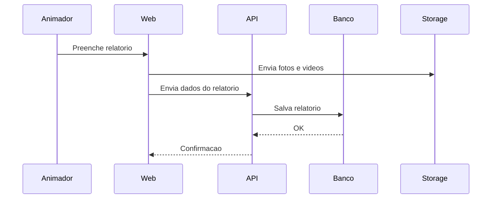

# 2. Arquitetura do Sistema

**Versao:** 1.0.0
**Ultima Atualizacao:** 2026-01-20

← [Voltar para SPEC](README.md)

---

## 2.1 Visao de Alto Nivel

```
Cliente (Browser)
    |
    | HTTPS
    v
API (Fastify)
    |
    | SQL
    v
PostgreSQL
    |
    | S3 API
    v
Object Storage (midias)
```

---

## 2.2 Componentes do Sistema

### Backend Service

| Componente | Responsabilidade | Tecnologia |
|------------|------------------|------------|
| API Routes | Endpoints REST | Fastify |
| Services | Regras de negocio | TypeScript |
| Repositories | Acesso a dados | Prisma |
| Auth | Login e roles | JWT |
| Jobs | Emails e notificacoes | BullMQ |

### Frontend Application

| Componente | Responsabilidade | Tecnologia |
|------------|------------------|------------|
| Pages | Rotas da aplicacao | Next.js |
| Components | UI reutilizavel | React |
| State | Dados e cache | React Query |
| Upload | Midia de relatorios | Upload direto + API |

### Data Layer

| Componente | Responsabilidade | Tecnologia |
|------------|------------------|------------|
| Database | Dados relacionais | PostgreSQL |
| Cache/Queue | Fila de jobs | Redis |
| Storage | Fotos e videos | S3 compativel |

---

## 2.3 Fluxo de Dados (Criacao de Relatorio)



---

## 2.4 Stack Tecnologico Detalhado

### Backend

| Tecnologia | Versao | Finalidade |
|------------|--------|------------|
| Node.js | 18+ | Runtime |
| TypeScript | 5+ | Tipagem |
| Fastify | 4+ | Framework web |
| Prisma | latest | ORM |
| Zod | latest | Validacao |
| BullMQ | 4+ | Filas |

### Frontend

| Tecnologia | Versao | Finalidade |
|------------|--------|------------|
| React | 18+ | UI |
| Next.js | 14+ | Framework |
| TailwindCSS | 3+ | Estilizacao |
| Radix UI | latest | Componentes |

### Infraestrutura

| Tecnologia | Versao | Finalidade |
|------------|--------|------------|
| PostgreSQL | 15+ | Banco principal |
| Redis | 7+ | Cache/Queue |
| Docker | 24+ | Containers |
| VPS | - | Hospedagem |

---

← [Voltar para SPEC](README.md) | [Proximo: Modelo de Dados →](03-modelo-dados.md)
