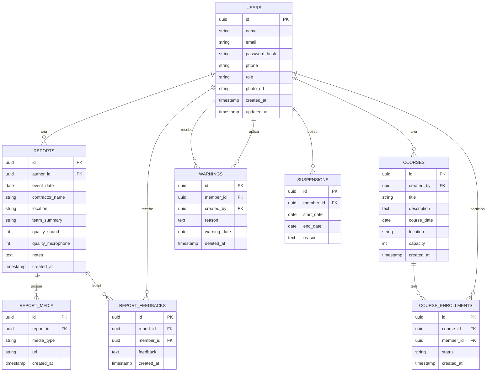

# 3. Modelo de Dados

**Versao:** 1.0.0
**Ultima Atualizacao:** 2026-01-20

← [Voltar para SPEC](README.md)

---

## 3.1 Diagrama Entidade-Relacionamento



---

## 3.2 Schemas das Tabelas

### Tabela: users

```sql
CREATE TABLE users (
    id UUID PRIMARY KEY DEFAULT gen_random_uuid(),
    name VARCHAR(100) NOT NULL,
    email VARCHAR(255) NOT NULL UNIQUE,
    password_hash VARCHAR(255) NOT NULL,
    phone VARCHAR(30),
    role VARCHAR(20) NOT NULL CHECK (role IN ('admin', 'animador', 'recreador')),
    photo_url TEXT,
    created_at TIMESTAMP NOT NULL DEFAULT NOW(),
    updated_at TIMESTAMP NOT NULL DEFAULT NOW()
);
```

### Tabela: reports

```sql
CREATE TABLE reports (
    id UUID PRIMARY KEY DEFAULT gen_random_uuid(),
    author_id UUID NOT NULL REFERENCES users(id),
    event_date DATE NOT NULL,
    contractor_name VARCHAR(150) NOT NULL,
    location VARCHAR(150) NOT NULL,
    team_summary VARCHAR(200),
    quality_sound INT,
    quality_microphone INT,
    notes TEXT,
    created_at TIMESTAMP NOT NULL DEFAULT NOW()
);
```

### Tabela: report_media

```sql
CREATE TABLE report_media (
    id UUID PRIMARY KEY DEFAULT gen_random_uuid(),
    report_id UUID NOT NULL REFERENCES reports(id) ON DELETE CASCADE,
    media_type VARCHAR(10) NOT NULL CHECK (media_type IN ('image', 'video')),
    url TEXT NOT NULL,
    created_at TIMESTAMP NOT NULL DEFAULT NOW()
);
```

### Tabela: report_feedbacks

```sql
CREATE TABLE report_feedbacks (
    id UUID PRIMARY KEY DEFAULT gen_random_uuid(),
    report_id UUID NOT NULL REFERENCES reports(id) ON DELETE CASCADE,
    member_id UUID NOT NULL REFERENCES users(id),
    feedback TEXT NOT NULL,
    created_at TIMESTAMP NOT NULL DEFAULT NOW()
);
```

### Tabela: courses

```sql
CREATE TABLE courses (
    id UUID PRIMARY KEY DEFAULT gen_random_uuid(),
    created_by UUID NOT NULL REFERENCES users(id),
    title VARCHAR(150) NOT NULL,
    description TEXT,
    course_date DATE NOT NULL,
    location VARCHAR(150),
    capacity INT,
    created_at TIMESTAMP NOT NULL DEFAULT NOW()
);
```

### Tabela: course_enrollments

```sql
CREATE TABLE course_enrollments (
    id UUID PRIMARY KEY DEFAULT gen_random_uuid(),
    course_id UUID NOT NULL REFERENCES courses(id) ON DELETE CASCADE,
    member_id UUID NOT NULL REFERENCES users(id),
    status VARCHAR(20) NOT NULL CHECK (status IN ('enrolled', 'attended', 'missed')),
    created_at TIMESTAMP NOT NULL DEFAULT NOW()
);
```

### Tabela: warnings

```sql
CREATE TABLE warnings (
    id UUID PRIMARY KEY DEFAULT gen_random_uuid(),
    member_id UUID NOT NULL REFERENCES users(id),
    created_by UUID NOT NULL REFERENCES users(id),
    reason TEXT NOT NULL,
    warning_date DATE NOT NULL,
    deleted_at TIMESTAMP
);
```

### Tabela: suspensions

```sql
CREATE TABLE suspensions (
    id UUID PRIMARY KEY DEFAULT gen_random_uuid(),
    member_id UUID NOT NULL REFERENCES users(id),
    start_date DATE NOT NULL,
    end_date DATE NOT NULL,
    reason TEXT
);
```

---

## 3.3 Indices Principais

| Tabela | Indice | Justificativa |
|--------|--------|---------------|
| users | idx_users_email | Login |
| reports | idx_reports_author | Lista por animador |
| course_enrollments | idx_course_member | Cursos do membro |
| warnings | idx_warnings_member | Advertencias do membro |

---

← [Voltar para SPEC](README.md)
