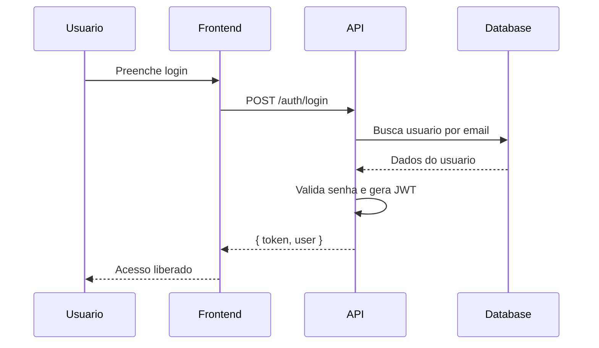
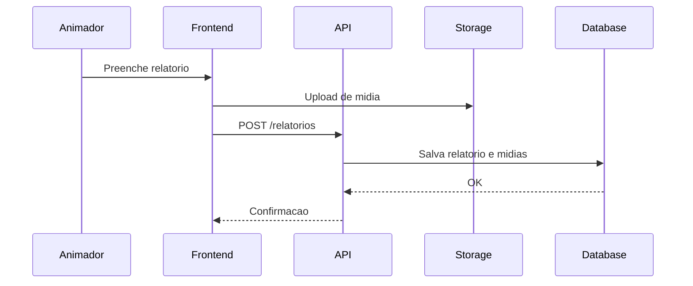
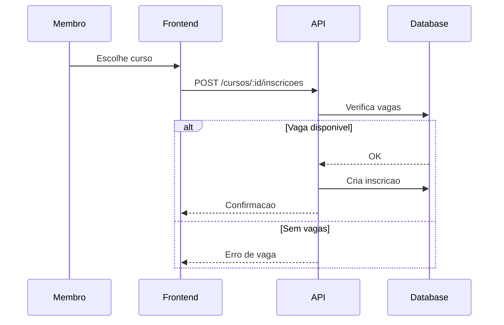

# 5. Diagramas de Sequencia

**Versao:** 1.0.0
**Ultima Atualizacao:** 2026-01-20

← [Voltar para SPEC](README.md)

---

## 5.1 Fluxo de Autenticacao

---

## 5.2 Fluxo de Criacao de Relatorio

---

## 5.3 Fluxo de Inscricao em Curso

---

← [Voltar para SPEC](README.md) | [Proximo: Maquina de Estados →](06-maquina-estados.md)
