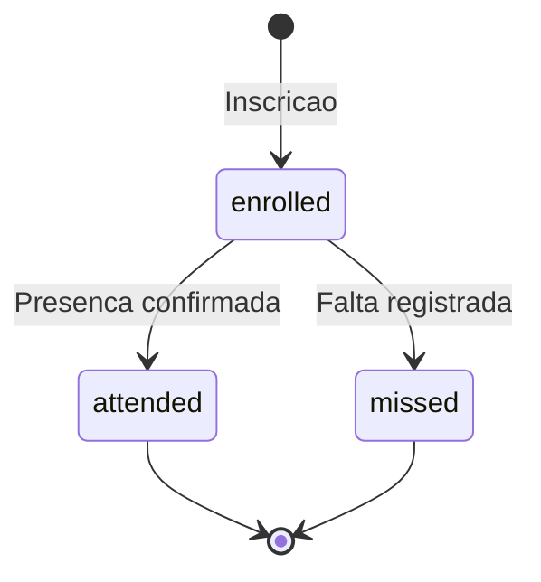
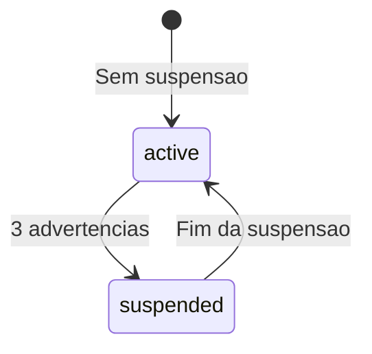

# 6. Maquina de Estados

**Versao:** 1.0.0
**Ultima Atualizacao:** 2026-01-20

← [Voltar para SPEC](README.md)

---

## 6.1 Estados de Inscricao em Curso

### Estados

| Estado | Descricao |
|--------|-----------|
| enrolled | Inscrito, aguardando curso |
| attended | Presenca confirmada |
| missed | Falta registrada |

---

## 6.2 Estados de Suspensao

### Estados

| Estado | Descricao |
|--------|-----------|
| active | Membro ativo |
| suspended | Membro suspenso por 1 mes |

---

← [Voltar para SPEC](README.md) | [Proximo: Tratamento de Erros →](07-tratamento-erros.md)
